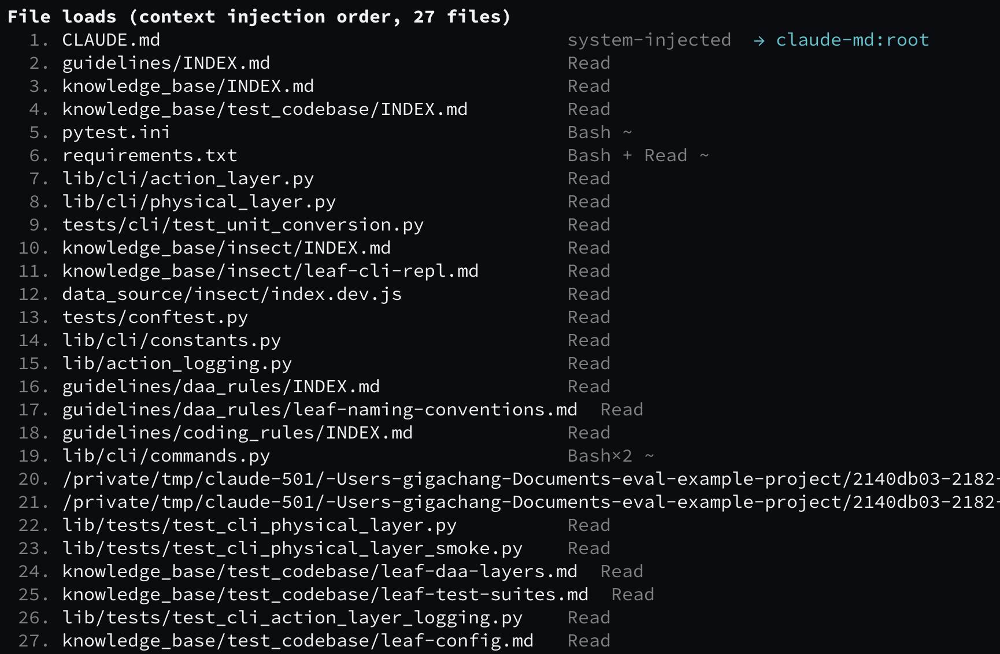
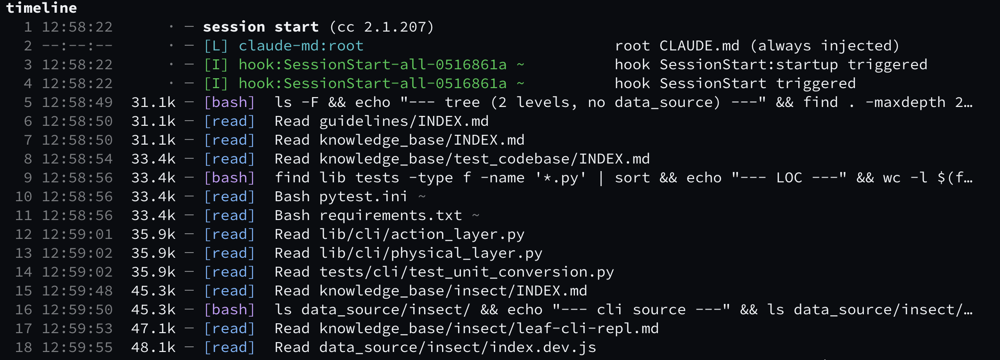
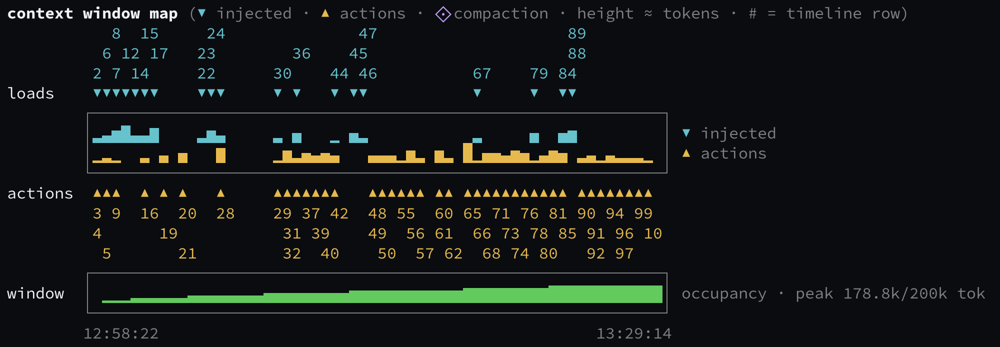

# context-render

Which of your Claude Code scaffolds — skills, commands, subagents, MCP servers, hooks, CLAUDE.md files — actually get used?

`context-render` reads your local session transcripts (read-only) and reports each component's state per session: **R** registered → **L** loaded → **I** invoked. No scores, no API calls, no telemetry — everything stays on your machine.

## Install

Requires Python 3.11+. Install straight from GitHub:

```bash
pip install git+https://github.com/gigayaya/context-render.git
```

Or clone first:

```bash
git clone https://github.com/gigayaya/context-render.git
cd context-render
pip install .
```

Either way you get the `context-render` command on your PATH.

## Quickstart

```bash
cd your-repo
context-render init           # scan scaffolds → .context-render/manifest.yaml
context-render sync           # ingest past sessions (idempotent, safe to re-run)
context-render last           # latest session: what was loaded/invoked, full timeline
```

Once you have some history:

```bash
context-render report --since 30d      # cross-session aggregate: active / low-use / deadweight
context-render deadweight --since 90d  # deadweight focus: token totals, share, cost estimate
context-render analyze --since 30d     # self-derivation cost: what the agent had to go find itself
```

## What a session report looks like

Every session report (`last` / `sessions <id-prefix>`) has three views of the same session:

**File loads** — every file that entered the context, in injection order, with how it got there (`Read`, `Bash`, system-injected) and, where possible, which component it's attributed to:



**Timeline** — the session as a chronological event list: hooks firing, CLAUDE.md injection, reads, bash commands, writes. `[L]` marks a load, `[I]` an invocation; `~` marks heuristic (vs. exact) attribution:



**Context-window map** — when tokens entered the window and what put them there: injected loads (▼) above, your actions (▲) below, numbers linking each bar back to its timeline row, and cumulative window occupancy along the bottom:



The report closes with a **SELF-DERIVATION** block — the top information needs the agent answered itself (searches, repo-structure mapping) with their token and window-occupancy cost; `analyze` aggregates the same rows across sessions.

See [docs/reports.md](docs/reports.md) for how to read each view in detail.

## Typical workflow

- **After a task**: run `last`. Expected a skill to fire but it never shows `L`? Its description/trigger never matched — fix it, verify on the next task.
- **Weekly**: run `report --since 30d`, review the deadweight list, delete dead components, rewrite low-use ones.

Before deleting anything, read [docs/limitations.md](docs/limitations.md) — used ≠ useful, and low use may just mean no relevant task came up in the window.

## Commands

```
context-render init        [--refresh] [--yes] [--hook|--no-hook]
context-render sync        [--since <spec>] [--force]
context-render last        [--md] [--evidence] [--full] [--no-timeline] [--no-graph]
context-render sessions    [<id-prefix>] [--since <spec>] [--md] [--evidence] [--full] [--no-timeline] [--no-graph]
context-render report      [--since 30d] [--md] [--no-timeline] [--no-graph]
context-render deadweight  [--since 90d] [--no-graph] [--md]
context-render analyze     [--since 30d] [--md] [--emit-prompt <#|key>]
context-render clear       [--yes]
context-render remove-hook
context-render help
```

| Command | What it does |
|---|---|
| `init` | Scan the repo's scaffolds into `.context-render/manifest.yaml`; optionally installs a SessionEnd hook for auto-ingest |
| `sync` | Parse past transcripts into the local db (idempotent; `--force` rebuilds) |
| `last` | Report the most recent finished session |
| `sessions` | List ingested sessions; `sessions <id-prefix>` shows any one session's full report |
| `report` | Cross-session aggregate over a time window |
| `deadweight` | Components that never got used in the window, with token/cost share |
| `analyze` | Self-derivation cost: every agent search is a question the harness didn't answer — what the agent went after, grouped and sorted by token cost. `--emit-prompt` packs one row's evidence into a scaffold-drafting prompt (plain text, offline) |
| `clear` | Delete recorded data (db + reports); manifest/config are kept. `sync` only rebuilds sessions whose transcripts still exist — `clear` names the ones that would be lost for good |
| `remove-hook` | Remove the SessionEnd hook that `init --hook` installed (other settings untouched) |

Common flags:

- `--since` accepts `30d` / `12w` / `2026-06-01` (bare dates are local midnight; an explicit offset like `2026-06-01T00:00:00+08:00` is honored)
- `--md` writes the complete markdown report to `.context-render/reports/` (terminal output truncates long lists)
- `--full` shows the complete session report in the terminal, keeping colors (no truncation, no file written)
- `--no-timeline` / `--no-graph` hide report sections; `NO_COLOR` disables colors

Session reports include a per-file load list, an action timeline, and a context-window map — see [docs/reports.md](docs/reports.md) for how to read them.

## Data & configuration

Everything lives under `<repo>/.context-render/`. `manifest.yaml` is the hand-editable, version-controlled asset. `config.yaml` is optional — thresholds, billing mode, price table: see [docs/configuration.md](docs/configuration.md).

`db.sqlite` is an archive, not a cache. Claude Code expires transcripts on a rolling window (`cleanupPeriodDays`, default 30 days), so `~/.claude/projects/` is a buffer rather than a source of truth: a full re-parse takes well under a second, but it can only recover sessions whose transcripts are still on disk. Once a transcript expires, its rows in `db.sqlite` are the only record left. It is gitignored — back it up if you want history beyond the retention window, and never "delete and rebuild" it to fix a problem.

## Documentation

- [Three-state model & design principles](docs/three-state-model.md) — what R/L/I mean and how to act on them
- [Reading the reports](docs/reports.md) — file loads, timeline, context-window map, colors, exit codes
- [Configuration](docs/configuration.md) — directory layout, config.yaml, SessionEnd hook
- [Limitations](docs/limitations.md) — read before deleting anything
- [Development](docs/development.md)

## Privacy

Zero uploads, zero telemetry, zero API calls in the core flow; transcripts are read-only and all outputs live in your repo.
